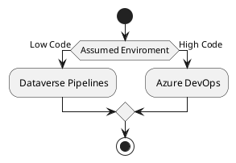

# Setup

## 1. Decide for Dataverse Pipelines or Azure DevOps for ALM

<tip>
Operating both approaches is possible and often practical

The platform's own ALM is used for the dataverse stream (in the standard case - LowCode).
Azure DevOps is used for parallel projects in the system boundary (interfaces, Fabrice, etc.).
</tip>

Our [Dataverse Pipelines Approach](Dataverse-Pipelines.md).  
Our [DevOps Approach](DevOps.md).

<note>
In general, it is also good practice, if source code management is in operation, to regularly keep the Dataverse solutions unpacked here as backups/change tracking.
</note>

_TODO Link to Pipeline sample for that_

<note>
When using ALM platforms unknown to us, we advise on the utilization of PAC and DGT options.
</note>

## 2. Setup Dataverse Enviroments

[Consult Dataverse Development Enviroment](Dataverse-Setup.md)