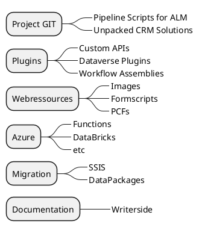
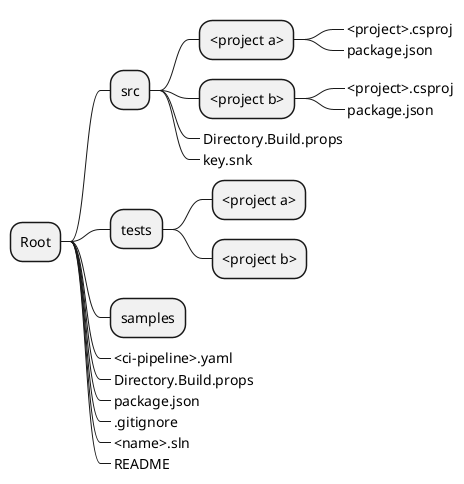
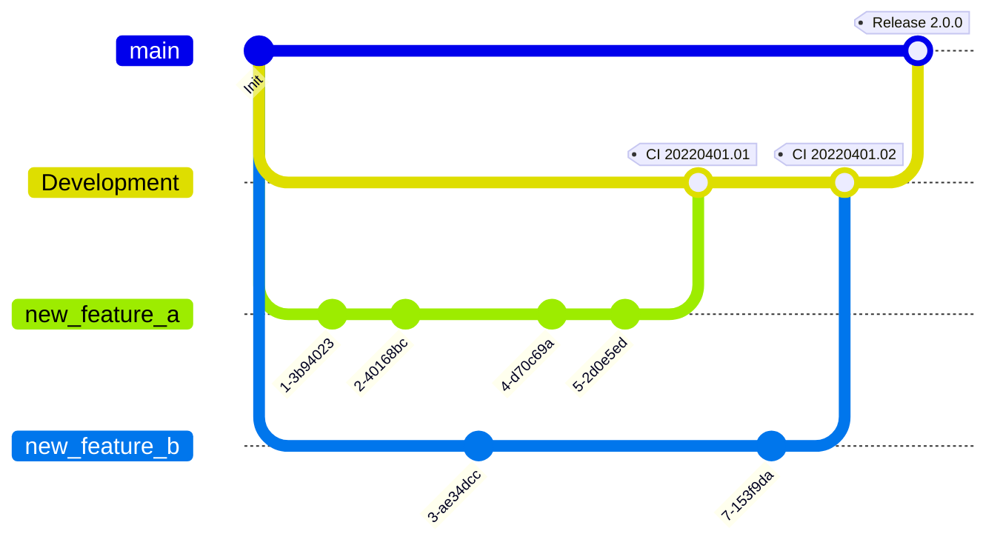

# Setup

## DevOps Project
An internal Azure DevOps project is created with the customer name - system name. Select the “Agile” template and GIt for the source code.
If the Extended Workbench is commissioned, a feature for the customer system name must be created here.

## Repository Structure

### Repositories

### Repositories Folder structure

### Repositories Branch Strategy

### .gitignore
Generate current .gitignore on [gitignore.io](https://www.toptal.com/developers/gitignore) for used IDE's and technology.
e.g. visualstudio,rider,visualstudiocode,dotnetcore

Add all folders where generated code is produced. For example, earlybound classes from DGTP or the transpiled 
JScript files from Typescript projects.