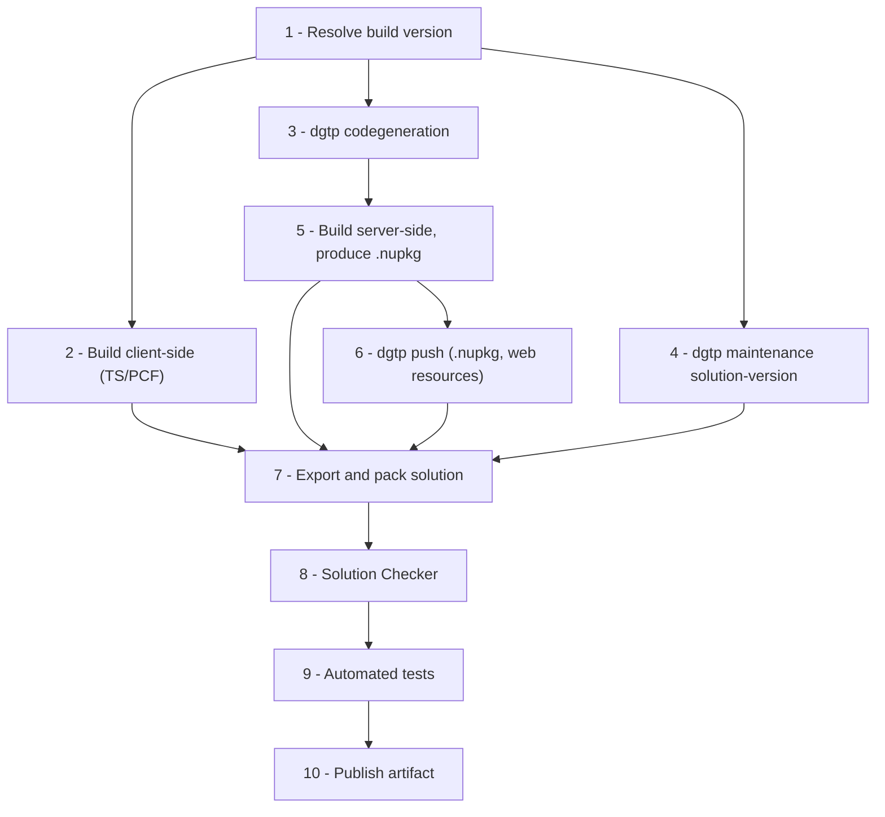

# Build Pipeline

This is the canonical order of steps for building a Dataverse project at DIGITALL, independent
of whether the orchestrator is Azure DevOps, GitHub Actions, or a script run by Power Platform
Pipelines' extensibility hooks. Individual platform chapters
([Azure DevOps](azure-devops.md), [GitHub Actions](github-actions.md),
[Power Platform Pipelines](power-platform-pipelines.md)) show how to wire these steps into
that platform's syntax; this page is the thing to point at when reviewing whether a pipeline
is missing a step.

## Step order

1. **Resolve the build version.**
   Compute the SemVer for this build from Git history (see [Versioning](versioning.md)).
   Everything downstream is stamped with this single version.

2. **Restore & build client-side projects.**
   `npm ci`, lint, `tsc`/bundler build for TypeScript web resources and PCF controls. Output
   goes to the folder referenced by the solution's web resource mapping.

3. **Regenerate early-bound models — *before* compiling server-side code.**
   Run `dgtp codegeneration` against the build environment so that `.cs`/`.ts` models reflect
   the current Dataverse schema. This must happen before step 4, since server-side projects
   reference the generated model. See
   [Early-Bound Models](../coding/serverside/early-binding.md).

4. **Bump the solution version in the build environment.**
   `dgtp maintenance solution-version <solution> --build` (or `--revision` for a hotfix). Must
   run before solution export (step 7), and after codegeneration only if codegeneration itself
   doesn't depend on the new version (it doesn't) — ordering relative to step 3 is therefore
   flexible, but both must complete before step 7.

5. **Build & package server-side projects.**
   Compile plugin/Custom API projects, producing the plugin package `.nupkg` (see
   [Plugin Packages](../coding/serverside/plugin-packages.md)). The assembly version stamped
   here is the same SemVer resolved in step 1.

6. **Push server-side artifacts to the build environment.**
   `dgtp push <package>.nupkg --solution <name> --publish` registers/updates the
   `PluginPackage`, `PluginAssembly`, plugin types, steps, and step images — see
   [Pre- & Post-Deployment Tasks](pre-post-deployment.md) for what this does under the hood.
   Push web resources the same way: `dgtp push ./WebResources --solution <name> --publish`.

7. **Export & pack the solution.**
   `pac solution export` (or sync an already-checked-out unpacked solution via
   `pac solution sync`) followed by `pac solution pack`, producing the managed/unmanaged
   solution `.zip` that becomes the pipeline artifact.

8. **Run the Solution Checker.**
   `pac solution check` against the packed solution as a quality gate — see
   [Solution Checker](../testing/solution-checker.md). A failing high-severity result stops
   the pipeline here.

9. **Run automated tests.**
   Server-side unit tests against `Digitall.Dataverse.Testing` (no live environment needed),
   plus any client-side tests. See [Testing & Quality](../testing/index.md).

10. **Publish the build artifact.**
    The packed solution `.zip`, plus any deployment settings / data files needed for
    [config & reference data migration](config-data-migration.md), become the artifact that
    later release stages deploy — via Power Platform Pipelines, a release pipeline, or a
    follow-up Actions job.

## Why this order matters

The two steps most often placed wrong:

- **Codegeneration before server-side build, not after.** If you build the plugin project
  against a stale generated model, the build succeeds but the plugin silently uses outdated
  field names at runtime — a much worse failure mode than a build error.
- **Solution version bump before export, not after.** `pac solution export` bakes whatever
  version is currently on the environment into `solution.xml`. Bumping after export has no
  effect on the artifact you're about to ship.

## Local builds (developer workstation)

A developer running the same steps locally during a feature loop does not need the version
bump (step 4) or the tag-creation that follows a successful pipeline run — only CI should bump
solution and Git versions. Steps 2, 3, 5, and 6 are exactly what a developer runs locally
against their own dev environment; see [Repository Bootstrap](../setup/repository-bootstrap.md)
for the equivalent local commands.
