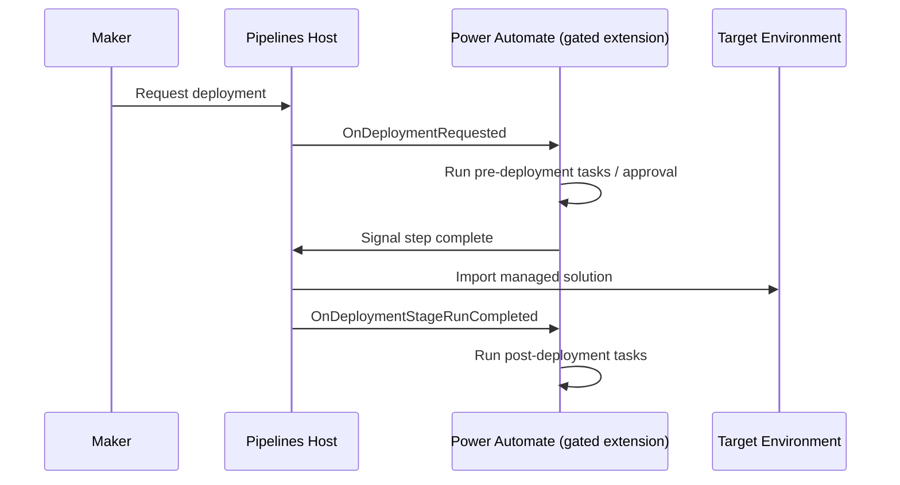

# Power Platform Pipelines

[Power Platform Pipelines](https://learn.microsoft.com/en-us/power-platform/alm/pipelines) is the in-product, low-code ALM path: a maker triggers a deployment
from inside their development environment, without needing Azure DevOps or GitHub knowledge.
Use it per the decision tree in [Deployment Approach](../architecture/deployment-approach.md);
this page covers how we configure and extend it once that decision is made.

## Prerequisites

- At least three environments (development, one or more test stages, production); four is the
  common recommendation (dev / test / UAT / prod).
- All target environments must be **[Managed Environments](https://learn.microsoft.com/en-us/power-platform/admin/managed-environment-overview)**.
- A dedicated **host environment** for the Power Platform Pipelines app — avoid hosting it in
  the default environment outside small/simple setups.
- `Deployment Pipeline Administrator` to configure the pipeline; `Deployment Pipeline User` for
  makers who run it.

!!! warning "Managed Environments are becoming mandatory"
    Starting February 2026, Microsoft enables Managed Environments automatically for any
    pipeline target environment that isn't already enabled. Don't treat this as optional or
    defer it to "later" on new projects — enable Managed Environments on all pipeline targets
    as part of environment setup, not as a reaction to a Message Center notice.

## Standard configuration

- Target environments always receive **managed** solutions. Unmanaged solutions are
  auto-exported from the source environment and stored in the pipelines host — download these
  for source control rather than treating them as the deployment artifact.
- Default import behavior is *Upgrade without Overwrite customizations*; we don't override
  this per pipeline stage unless a specific migration requires it.
- Use a dedicated publisher/prefix per project (see
  [Publisher & Prefix](../architecture/publisher-and-prefix.md)) — this is also a pipelines
  best practice from Microsoft, since it keeps automated deployments unambiguous about
  ownership.
- Environment variables and connection references are defined with no value in the source
  solution; values are supplied per target environment, either manually or — preferably, for
  delegated/unattended runs — through the deployment settings file.

## Deploying with a service principal

**`DGT-ALM-120`**{ #dgt-alm-120 } — Production deployments through Power Platform Pipelines run
as **delegated deployments** — the pipeline stage executes as a service principal (or a
designated pipeline stage owner), not as the requesting maker's own identity, and production
stages require an **approval**. This means:

- a maker can request a production deployment without holding elevated access in production
  themselves;
- the deployment proceeds only after **approval** from an authorized identity.

Set this up via the pipeline stage configuration in the Deployment Pipeline Configuration app;
the service principal must be added as an owner of itself in [Microsoft Entra ID](https://learn.microsoft.com/en-us/entra/fundamentals/whatis) for the
pipeline stage owner relationship to resolve correctly.

## Extending pipelines (gated extensions)

Pipelines emit real-time Dataverse business events at the start and completion of each stage,
which a Power Automate cloud flow (running in the pipelines host environment) can subscribe to.
This is how we plug DIGITALL-specific automation into an otherwise low-code deployment flow
without abandoning it for a full Azure DevOps/GitHub setup.

Two extension points matter most for us:

- **`Is Delegated Deployment`** — covered above.
- **`Pre-deployment Step Required`** — inserts a custom step after a deployment is approved but
  before it executes. The step stays pending until your flow signals completion or rejection.
  This is the hook we use for tasks that don't belong in the build artifact itself: triggering
  [config/reference data migration](config-data-migration.md), confirming environment variable
  values are set, or running a final external approval.

Triggers and actions are exposed under the Dataverse "When an action is performed" trigger in
cloud flows created in the pipelines host environment; Microsoft ships sample flows for these
triggers that are a reasonable starting point to adapt rather than building from scratch.

## Comparing layers and diffs

Within a target environment, pipelines retain layering history — you can inspect what changed
between deployed layers, including XML diffs for model-driven apps, site maps, and forms. For
deeper diffs (e.g. plugin code, not just solution XML), rely on Git integration and your normal
pull-request review instead — pipelines' built-in diff view is a deployment-history tool, not a
code-review tool.

## What stays in source control regardless

Even on a project running primarily on Power Platform Pipelines, keep the unpacked solution in
source control as described in [Source Control](source-control.md). Pipelines manage
*promotion*; they are not a substitute for change history, code review, or the build steps in
[Build Pipeline](build-pipeline.md) — those still need to run before a solution reaches the
pipelines host as a build artifact.
