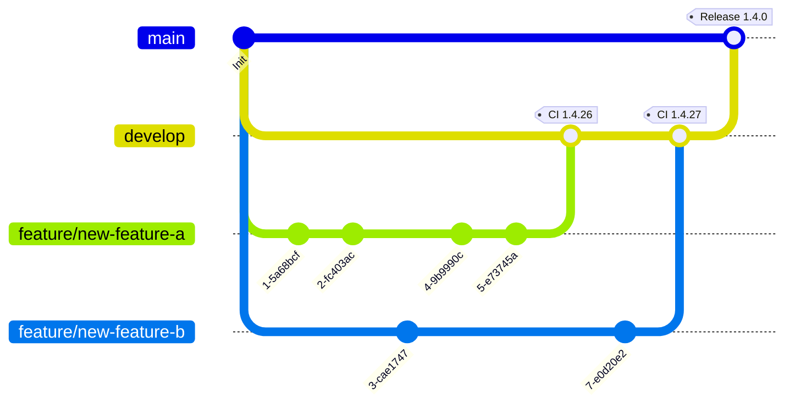

# Source Control

## Repository layout

```text
Root
├── src/
│   ├── <ServerSideProject>/
│   │   ├── <Project>.csproj
│   │   └── ...
│   ├── <ClientSideProject>/
│   │   ├── package.json
│   │   └── ...
│   ├── Directory.Build.props
│   └── key.snk                      # only if signing classic (non-package) assemblies
├── solutions/
│   └── <SolutionUniqueName>/        # unpacked solution, see below
├── tests/
│   └── <Project>.Tests/
├── pipelines/                       # CI/CD definitions and scripts
│   └── ...
├── .gitattributes
├── .gitignore
├── Directory.Build.props
├── <name>.sln
└── README.md
```

Note the top-level `solutions/` folder for unpacked Dataverse solutions, kept alongside the code
rather than in a separate repository — see below.

## Keep unpacked solutions in source control

**`DGT-ALM-010`**{ #dgt-alm-010 } — Regardless of which [deployment approach](../architecture/deployment-approach.md) a project
uses — Power Platform Pipelines, Azure DevOps, or GitHub Actions — regularly commit the
**unpacked** Dataverse solution to this repository. This gives you change history and
reviewable diffs even on a project where the platform's own ALM does the actual deployment.

```shell
pac solution sync --solutionFolder solutions/dgt_myproject_core
```

`pac solution sync` keeps a previously cloned unpacked solution up to date with the source
environment without re-cloning from scratch, and is safe to run repeatedly as part of a
developer's local workflow or a scheduled CI job that just commits the diff.

## Branching strategy



- `main` reflects production.
- `develop` is the integration branch for the current release.
- Feature branches are named `feature/<work-item-reference>` — referencing the work item makes
  it trivial to trace a change back to its acceptance criteria later.
- CI tags every successful build merged into `develop` (see [Versioning](versioning.md));
  releases to `main` get a release tag.

## `.gitattributes`

**`DGT-ALM-020`**{ #dgt-alm-020 } — Enforce a single line-ending convention across the repository — mixed `CRLF`/`LF` in generated
TypeScript or `.cs` files produces noisy diffs that obscure real changes:

```text title=".gitattributes"
* text=auto eol=lf
*.cs text eol=crlf
*.sln text eol=crlf
```

Pick `crlf` or `lf` per file type based on what your team's editors default to, but be
consistent — don't leave it to each contributor's local Git config.

## `.gitignore`

Generate a baseline from [gitignore.io](https://www.toptal.com/developers/gitignore) for the
IDEs and stacks in use, e.g. `visualstudio,rider,visualstudiocode,dotnetcore,node`, then add:

- the early-bound model output folder generated by `dgtp codegeneration` (see
  [Early-Bound Models](../coding/serverside/early-binding.md)) — generated code is reproducible
  from the build step and shouldn't be committed;
- transpiled JavaScript output from TypeScript web resource projects;
- the `bin\outputPackages` (or equivalent) folder where built `.nupkg` plugin packages land.

## What does *not* belong in this repository

**`DGT-ALM-030`**{ #dgt-alm-030 } — The repository never contains:

- Secrets (connection strings, client secrets, API keys) — these belong in pipeline variable
  groups / secrets, or Key Vault, referenced by name. See
  [Pre- & Post-Deployment Tasks](pre-post-deployment.md).
- Environment-specific data values for environment variables/connection references — see
  [Config & Reference Data Migration](config-data-migration.md).
- Managed solution `.zip` build artifacts — these are pipeline outputs, not source.

A secret that lands in Git history is compromised even after the commit is reverted — rotate
it; don't just delete the line.
