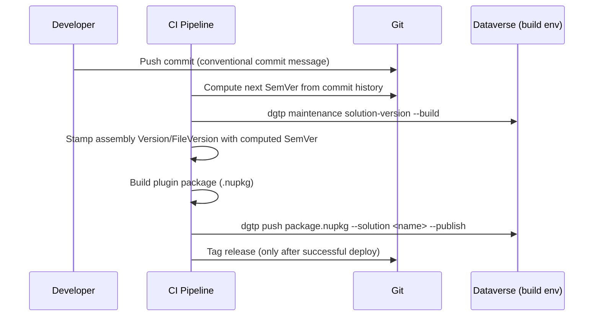

# Versioning

Three things get a version number on a Dataverse project, and they are easy to conflate
because they are usually bumped together: the **Dataverse solution**, the **plugin
assembly/package**, and the **Git history** that produced both. This chapter treats them
separately and then shows how they line up.

## Solution version

Dataverse solution versions use a four-segment `Major.Minor.Build.Revision` format. We map this
to the build that produced it rather than to manual judgment calls:

| Segment | Meaning on our projects |
|---|---|
| `Major` | Breaking change / major release boundary, bumped deliberately, rarely automated. |
| `Minor` | A sprint or feature release. |
| `Build` | Bumped automatically by CI for every build that gets deployed past dev. |
| `Revision` | Reserved for emergency/hotfix builds against an already-released `Build`. |

**`DGT-ALM-040`**{ #dgt-alm-040 } — Bumping is **not** done by hand-editing `solution.xml`. Use `dgtp maintenance solution-version`,
which reads the current version directly from the target Dataverse environment and writes the
incremented version back:

```shell
dgtp maintenance solution-version sample_solution --minor
```

```text
dgtp maintenance solution-version <solution-unique-name> [--major|--minor|--build|--revision]
```

!!! warning "This command targets a live environment, not a local file"
    `solution-version` connects to the environment selected by the active `dgtp` profile and
    updates the `Solution` record there. It does not touch a checked-out `solution.xml`. Run it
    against the environment you are about to export/build from — typically your CI build agent's
    target dev/build environment — immediately before packaging, so the version that gets baked
    into the exported solution is the incremented one.

In a pipeline, this means the version bump is a build step that runs *before* `pac solution
export` / `pac solution pack`, not a property edit committed to source.

## Plugin assembly / package version

For [plugin packages](../coding/serverside/plugin-packages.md), the relevant version lives in
the project's `<Version>` (and `<FileVersion>`) in the `.csproj`, which becomes the `.nupkg`
version. `dgtp push` compares this against what is already registered in Dataverse and decides
whether to create or upgrade the `PluginPackage`/`PluginAssembly` records — see
[Pre- & Post-Deployment Tasks](pre-post-deployment.md).

**`DGT-ALM-050`**{ #dgt-alm-050 } — Because of this, **the assembly version must increase on every build that gets pushed**,
including dev-loop builds — Dataverse only re-imports a package whose version is higher than
what's already registered. We bump the `Revision` segment automatically on every CI build
using the build number (see below); `Major.Minor.Build` follow the same release cadence as the
solution they ship in.

```xml title="Directory.Build.props (excerpt)"
<PropertyGroup>
  <VersionPrefix>1.4.0</VersionPrefix>
  <!-- Revision is appended by CI: -BuildNumber, see Build Pipeline -->
</PropertyGroup>
```

## Git versioning

We tag releases in Git so that a solution/assembly version can always be traced back to the
exact commit that produced it, and so the next build knows which version to bump from.

- Tags follow `v<Major>.<Minor>.<Build>` (matching the solution `Build` segment), e.g. `v1.4.27`.
- Tags are created **by CI**, not manually, immediately after a successful deployment to the
  reference environment for that pipeline stage — not on every commit to a branch.
- We use [semantic-release](https://semantic-release.gitbook.io/) (or an equivalent
  conventional-commits-based tool) to compute the next version from commit messages and create
  the tag and changelog entry automatically. This is the same mechanism `dgt.power` itself
  uses for its own releases — see its
  [`CHANGELOG.md`](https://github.com/DIGITALLNature/DigitallPower/blob/main/CHANGELOG.md) for
  a working example of the commit convention (`feat:`, `fix:`, `BREAKING CHANGE:`, scoped like
  `feat(push): ...`).
- The computed version is exposed to the build as a pipeline variable (e.g.
  `$(GitVersion.SemVer)` / `${{ steps.semver.outputs.version }}` depending on platform) and fed
  into both the solution-version bump and the assembly version — this is what keeps all three
  numbers traceable to one commit.

!!! tip "Why automate this instead of bumping by hand"
    Manual version bumps are the single most common source of "why didn't my plugin change
    take effect" support tickets — usually because the package version didn't actually
    increase, so Dataverse kept the previously registered assembly. Automating it removes the
    failure mode entirely.

## Putting it together


