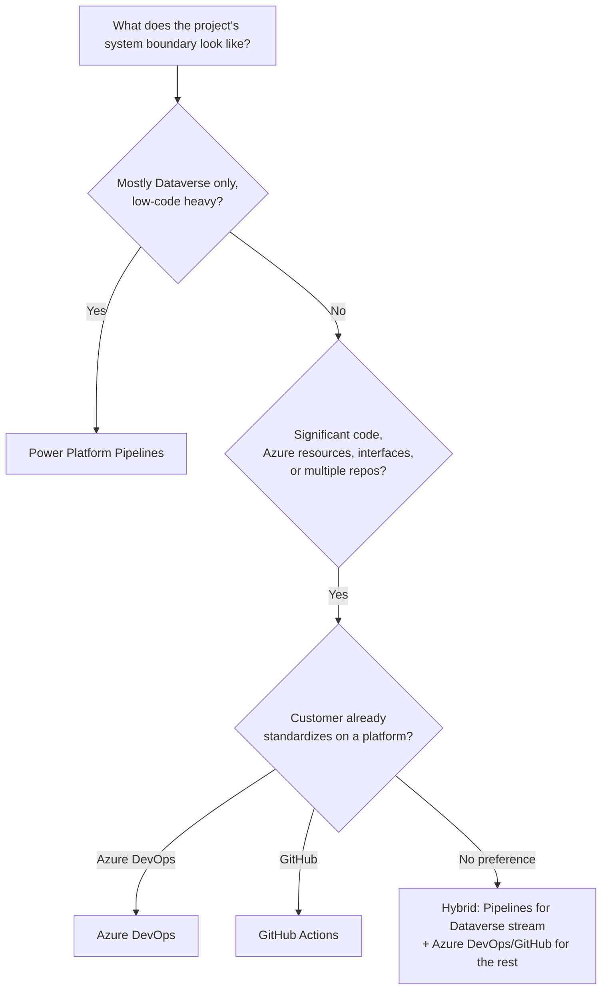

# Deployment Approach

Decide this once, early in the project, ideally before the first solution is created — changing
direction later is possible but costs rework on both the pipeline and the team's habits.

## Decision tree

## The three options

**Power Platform Pipelines** — the in-product, low-code path. Best fit when the project is
primarily Dataverse customization with limited pro-code, and the team includes citizen
developers who shouldn't need ALM tooling knowledge to ship a change. See
[Power Platform Pipelines](../alm/power-platform-pipelines.md).

**Azure DevOps** — the high-code path, YAML pipelines, Power Platform Build Tools. Best fit
when the customer already runs Azure DevOps for other systems, or the project's system
boundary includes substantial non-Dataverse Azure work that benefits from one orchestrator.
See [Azure DevOps](../alm/azure-devops.md).

**GitHub Actions** — the same high-code path on GitHub. Best fit when the customer (or
DIGITALL's own tooling) is GitHub-native. See [GitHub Actions](../alm/github-actions.md).

## Operating both approaches together

Running Power Platform Pipelines and Azure DevOps/GitHub Actions **in combination is common
and often the most practical setup**, rather than a compromise: the platform's own ALM handles
the Dataverse stream (the standard case for low-code work), while Azure DevOps/GitHub Actions
covers parallel work within the wider system boundary — interfaces, Azure Functions, data
platform components, and anything outside Dataverse itself.

The two are bridged through [pipelines extensibility](../alm/power-platform-pipelines.md#extending-pipelines-gated-extensions):
a gated extension Power Automate flow can trigger a GitHub Actions workflow or an Azure DevOps
pipeline as part of a pipelines deployment, and vice versa — a CI pipeline can trigger a
pipelines deployment via the [Dataverse Web API](https://learn.microsoft.com/en-us/power-apps/developer/data-platform/webapi/overview).

## Keep solutions under source control regardless

Whichever path a project takes, keep the **unpacked solution under source control**, even if
the platform's own pipelines do the actual promotion — see
[Source Control](../alm/source-control.md). This isn't optional based on the deployment
approach; it's how you get change history and code review regardless of how deployment itself
is orchestrated.

## When ALM tooling is unfamiliar

If a customer mandates an ALM platform DIGITALL hasn't worked with before, default to
**PAC CLI** and `dgtp` for the parts of the pipeline that are platform-agnostic (codegen,
push, version bumping — see [Build Pipeline](../alm/build-pipeline.md)), and wrap those calls
in whatever orchestration syntax the unfamiliar platform requires, rather than trying to learn
that platform's native equivalents for everything from day one.
