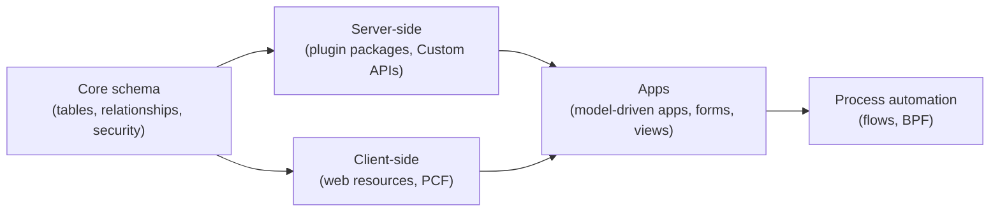
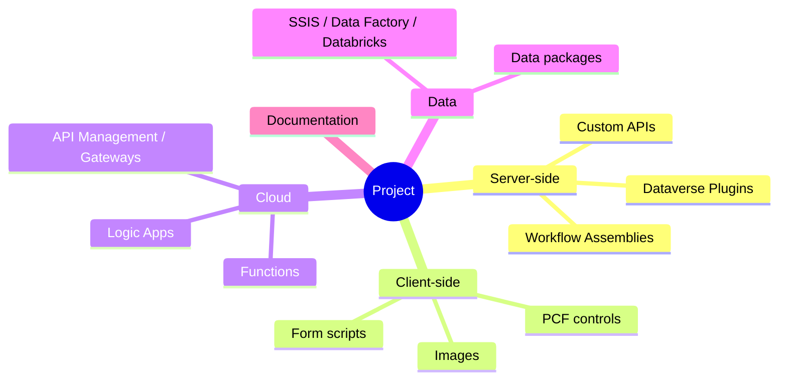

# Solution Architecture

## Layer by component type, with a defined dependency direction

**`DGT-ARC-080`**{ #dgt-arc-080 } — Organize Dataverse solutions by component type rather than by feature, with a strict,
documented dependency direction between them. A layered approach like this scales better than
one large solution as a project grows, and keeps the blast radius of a single deployment small
and predictable.

A typical layering, lowest dependency first:

Solutions only depend "downward" in this picture — process automation can reference apps and
both code layers, but the core schema solution never references anything above it. This keeps
a schema-only deployment possible without dragging in unrelated app or automation changes.

## One home per component, segmented export

**`DGT-ARC-100`**{ #dgt-arc-100 } — A given unmanaged component lives in **exactly one**
solution, and tables are added to solutions **segmented** — selected subcomponents or "include
table metadata only", never "Add all assets". The same component in two solutions produces
layer and merge conflicts on import; "all assets" drags in every current and future
subcomponent and creates dependencies between solutions that nobody chose. See
[Microsoft's solution-organization guidance](https://learn.microsoft.com/en-us/power-platform/alm/organize-solutions).

## Naming solutions

Name each layered solution consistently, e.g. `<prefix>_<project>_core`,
`<prefix>_<project>_plugins`, `<prefix>_<project>_app`. This also keeps
[`dgtp` config filters](../coding/serverside/early-binding.md) (which can scope code generation
to specific solutions) and CI export/import steps readable without a lookup table.

## Repositories per component category

Mirroring the solution layering, repositories (or top-level folders within one repository — see
[Source Control](../alm/source-control.md)) are typically split along:

Whether this is one monorepo or several repositories depends on team size and release cadence
— both work, but pick deliberately and document the choice rather than letting it emerge
file-by-file.

## Managed vs. unmanaged

- **`DGT-ARC-090`**{ #dgt-arc-090 } — Development environments hold the **unmanaged** solution.
- Every other environment (test, UAT, production) receives the solution as **managed**, always
  — see [Power Platform Pipelines](../alm/power-platform-pipelines.md) and
  [Build Pipeline](../alm/build-pipeline.md) for how this is enforced by the pipeline rather
  than left to deployer discipline.
- Patches and 1:1 layering on top of a managed solution are acceptable for hotfixes, but should
  be reconciled back into the next full release rather than accumulating indefinitely — use
  `dgtp analyze redundantpatches` periodically to catch patches that no longer contain any
  top-layer components and can be retired. See [Reference](../reference/dgtp-commands.md).