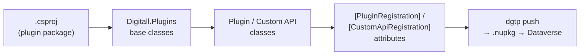

# Coding — Server-side

Plugins, Custom APIs, and workflow assemblies. This chapter assumes the
[plugin package](plugin-packages.md) format rather than classic single-assembly registration —
that's the default for new projects.

- [Overview](#what-a-new-server-side-project-looks-like)
- [Project Setup](project-setup.md) — csproj, `.editorconfig`, signing.
- [Plugin Packages](plugin-packages.md) — the dependent-assembly NuGet package format.
- [DIGITALL Assembly (Digitall.Plugins)](digitall-assembly.md) — our base classes and
  abstraction layer.
- [Registration Attributes](registration-attributes.md) — declarative step registration via
  `Digitall.Plugins.Registration`.
- [Early-Bound Models](early-binding.md) — generating `.cs` models with `dgtp`.
- [Custom API & Data Providers](custom-api.md)
- [Patterns & Pitfalls](patterns.md)

## What a new server-side project looks like

A project references **`Digitall.Plugins`** for the base plugin/Custom API/workflow abstraction,
decorates classes with **`Digitall.Plugins.Registration`** attributes instead of registering
steps by hand in the Plugin Registration Tool, and ships as a **plugin package** pushed via
`dgtp push` — see [Pre- & Post-Deployment Tasks](../../alm/pre-post-deployment.md#dgtp-push-in-depth)
for exactly what that push does.
